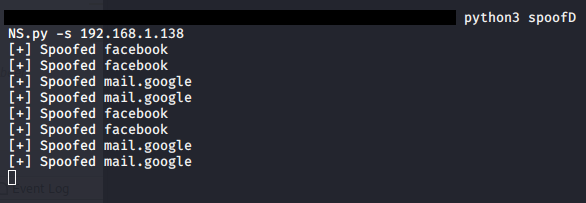

# DNS Spoofer
Manipulating the A type DNS responses to redirect target computer from desired URL's to our own URL. Must be the man-in-the-middle for phishing attacks. Repository for educational purposes only. 
## Getting Started
Download the repository on your linux system and use:
> Python == 3.7.4
>
> Scapy == 2.4.3
>
> NetfilterQueue == 0.8.1
>
## Details
| File | Information |
|-------|------------|
| interceptor.py  | Cut the internet connection of the target machine  | 
| output.png  | output of the spoofer | 
| output2.png  | result of the spoofer | 
| spoofDNS.py  | main program | 
| venv  | Python environment | 
## Output

## Result

